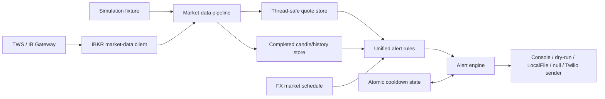

# ForexAlert

ForexAlert is an alert-only foreign-exchange monitoring service for Interactive Brokers TWS or IB Gateway. It subscribes to configured currency pairs, normalizes bid/ask data, builds completed UTC candles, evaluates configurable movement rules, and sends notifications through an explicitly selected provider.

ForexAlert never places trades or submits orders. It is educational software, not financial advice, and it makes no claim of predictive accuracy.

## Highlights

- .NET 10 SDK-style solution using Generic Host, dependency injection, validated options, structured logging, and graceful cancellation.
- One canonical pair list and one alert engine for daily, hourly, weekly, and optional one-minute rules.
- Thread-safe quote and bounded candle stores; stale, timestamp-skewed, invalid, crossed, duplicate, and out-of-order data are handled deliberately.
- One IBKR market-data connection with bounded startup, capped exponential reconnects, collision-free request IDs, inverse-contract fallback, and subscription cleanup.
- Atomic JSON cooldown persistence by rule and canonical symbol.
- Console, dry-run, LocalFile, null, and Twilio notification providers. External delivery is disabled by default.
- An offline simulation that exercises the complete pipeline without TWS, IB Gateway, Twilio, an account identifier, or a network connection.

## What it does not do

- It does not place, stage, recommend, or manage orders.
- It does not request portfolio or managed-account data.
- It is not an AI model. The disconnected legacy momentum heuristic was removed rather than marketed as prediction.
- It does not provide a holiday calendar. The schedule models the normal FX weekend closure and documents this limitation explicitly.

## Architecture



Application code lives in `src/ForexAlert`, and tests live in `tests/ForexAlert.Tests`. The repository does not redistribute Interactive Brokers source or binaries. Live connectivity is an optional local build that references an official `IBApi.dll` obtained separately by the operator.

## Alert rules

All comparisons are inclusive of the configured threshold and use completed data only.

| Rule                |        Default | Calculation                                                                                                                     |
| ------------------- | -------------: | ------------------------------------------------------------------------------------------------------------------------------- |
| Daily movement      |  1.4% absolute | Latest fresh midpoint versus the previous completed daily close. During the sleep window, only a fall of 2.4% or more triggers. |
| Hourly movement     |  1.4% absolute | Open versus close of the latest completed one-hour candle.                                                                      |
| Weekly movement     |  5.0% absolute | Oldest versus newest close among the latest five distinct completed trading-day closes.                                         |
| One-minute movement | Disabled; 1.4% | Open versus close of the latest completed one-minute candle.                                                                    |

The daily baseline can be changed to `TradingDayOpen`; it then requires the completed one-minute candle at the configured market-date opening time (`MarketSchedule:TradingDayOpenTime`, midnight New York by default, with the configured Sunday reopen used on Sunday). Process-start prices are never implicit baselines.

Cooldowns are keyed by rule and canonical symbol (for example, `hourly-movement|EUR/USD`) and persist across restarts. By default, state is stored under the user's cross-platform local application-data directory (`ForexAlert/alert-state.json`), outside build output, so builds and cleans do not erase it. A configured absolute `Persistence:AlertStatePath` is preserved; configured relative paths resolve from the application base directory. State advances only after successful delivery.

## Prerequisites

- [.NET 10 SDK](https://dotnet.microsoft.com/download/dotnet/10.0)
- For live data only: Interactive Brokers TWS or IB Gateway with API access enabled, plus the official TWS API obtained directly from Interactive Brokers
- For real SMS only: a Twilio account and sender, configured outside source control

The repository pins SDK feature band `10.0.301` in `global.json` and allows forward roll within newer installed .NET 10 feature bands.

## Build and test

```bash
git clone https://github.com/RealTimGFM/ForexAlert.git
cd ForexAlert
dotnet restore
dotnet build -c Release
dotnet test -c Release
dotnet format --verify-no-changes
```

Validate safe configuration without contacting IBKR:

```bash
dotnet run --project src/ForexAlert/ForexAlert.csproj -- --validate-config
```

Run the bundled end-to-end simulation:

```bash
dotnet run --project src/ForexAlert/ForexAlert.csproj -- --simulate sample-stream
```

The fixture emits representative daily, hourly, and weekly alerts to the console and exits successfully. It contains no private data.

## Command line

```text
--dry-run                 Force external notifications off
--validate-config         Validate options and exit without connecting
--simulate <fixture>      Run an offline JSON fixture and exit
--once                    Connect, load initial data, evaluate once, and exit
--help                    Display usage
```

Run `dotnet run --project src/ForexAlert/ForexAlert.csproj -- --help` for the canonical help text.

## Configuration

`src/ForexAlert/appsettings.json` contains safe, non-secret defaults. Override values with user secrets or environment variables. Environment-variable keys use `FOREXALERT_` and double underscores:

```text
FOREXALERT_Ibkr__Host=127.0.0.1
FOREXALERT_Ibkr__PaperTrading=true
FOREXALERT_Ibkr__PaperPort=4002
FOREXALERT_CurrencyPairs__Pairs__0=EUR/USD
FOREXALERT_Notifications__Provider=DryRun
FOREXALERT_Notifications__DryRun=true
FOREXALERT_LocalFile__AlertLogPath=C:\path\to\alerts.txt
```

See `.env.example` for the full secret names. A `.env` file is ignored by Git, but the application does not parse dotenv files itself; export those values through your shell, IDE, container, or secret manager.

For local user secrets:

```bash
dotnet user-secrets --project src/ForexAlert/ForexAlert.csproj set "Twilio:AccountSid" "..."
dotnet user-secrets --project src/ForexAlert/ForexAlert.csproj set "Twilio:AuthToken" "..."
dotnet user-secrets --project src/ForexAlert/ForexAlert.csproj set "Twilio:FromNumber" "+15555550100"
dotnet user-secrets --project src/ForexAlert/ForexAlert.csproj set "Twilio:Recipients:0" "+15555550101"
```

Real Twilio delivery requires both `Notifications:Provider=Twilio` and `Notifications:DryRun=false`. Startup validation rejects that combination when credentials or recipients are missing. Logs report only recipient counts, never full numbers or credentials. Successful recipients from a partial failure are retained in a bounded, expiring in-process retry cache (`Twilio:SuccessfulRecipientCacheCapacity` and `Twilio:SuccessfulRecipientCacheDuration`) so a same-process retry does not duplicate delivery. Recipient-level partial-delivery state is not persisted, so restart-safe partial-recipient delivery is not implemented.

To append alerts to a local text file, set `Notifications:Provider=LocalFile`. Configure its destination with `LocalFile:AlertLogPath`; the default is `ForexAlert/alerts.txt` under the current user's local application-data directory. LocalFile is local output only and is not an external notification or delivery service.

## Optional local IBKR API integration

The public-safe default build supports configuration validation and offline simulation but deliberately cannot open a live IBKR connection. Obtain the official TWS API directly from Interactive Brokers and comply with its license; do not copy its source or binaries into this repository.

Provide the absolute path to the official local assembly at build time:

```bash
dotnet build ForexAlert.sln -c Release -p:IBApiAssemblyPath=/absolute/path/to/IBApi.dll
dotnet run --project src/ForexAlert/ForexAlert.csproj -c Release -p:IBApiAssemblyPath=/absolute/path/to/IBApi.dll
```

On PowerShell, quote the property argument when the path contains spaces. ForexAlert enforces connection timeouts in its own asynchronous code and does not require a patched or custom `ConnectTimeout` member in `IBApi.dll`.

## IBKR paper-account setup

1. Start TWS or IB Gateway and sign in to a paper account.
2. Enable socket API clients in the API settings.
3. Enable **Read-Only API** as defense in depth; ForexAlert needs market data only.
4. Confirm the configured port. IB Gateway commonly uses paper `4002` and live `4001`; TWS commonly uses paper `7497` and live `7496`.
5. Choose a client ID not used by another API client.
6. Confirm market-data permissions for every configured pair.
7. Start with `--dry-run` and inspect connection, subscription, historical-data, and alert logs.

ForexAlert requests `IDEALPRO` CASH midpoint data. When IBKR rejects a pair orientation, the client cancels that request, allocates a new request ID, tries the inverse contract, and converts inverse bid/ask and OHLC data back to the requested canonical pair.

Startup waits for complete historical responses but not for an immediate bid/ask, so a connected weekend session remains healthy. Alert evaluation begins per pair only after a fresh bid and ask within `Ibkr:MaximumBidAskSkew` are available. `--once` waits up to `Ibkr:InitialDataTimeout` for at least one such midpoint and exits with code 3 and a clear error when none arrives. Incomplete live candles and quote synchronization state are discarded at connection boundaries, so one-minute and one-hour candles cannot span a disconnect. Completed daily history is refreshed at `Ibkr:DailyHistoryRefreshInterval` while the service remains connected, and initial, refreshed, and connectivity-restored historical requests observe `Ibkr:HistoricalRequestSpacing`.

## Scheduling and time

All internal timestamps are UTC `DateTimeOffset` values. The default market zone is IANA `America/New_York`, which observes daylight-saving transitions on Windows and Linux under modern .NET. The normal closure is Friday 17:00 through Sunday 17:00 New York time. Configured sleep time defaults to 23:30 through 05:00.

Bank holidays and exceptional broker closures are not modeled. Override the schedule in tests/configuration or stop the service during exceptional closures.

## Troubleshooting

- **Public-safe build error:** obtain the official TWS API separately and rebuild with `IBApiAssemblyPath` pointing to its `IBApi.dll`.
- **Connection timeout:** confirm TWS/Gateway is running, API sockets are enabled, the port matches the selected paper/live mode, and the client ID is free.
- **No quotes:** verify IBKR market-data permissions and look for request-specific error codes. Informational farm-status codes are logged separately from failures.
- **No daily alert:** daily rules wait for a completed historical daily close and a fresh bid plus ask. They never fall back to process startup price.
- **No hourly/weekly alert:** rules require completed bars; an in-progress bar is deliberately excluded.
- **Configuration failure:** run `--validate-config`; validation errors name the safe configuration key but never print its value.
- **Malformed state file:** repair or remove the reported JSON state file. ForexAlert does not silently discard cooldown history.

## Security and licensing

Never commit Twilio credentials, recipient numbers, broker identifiers, or account data. Review [SECURITY.md](SECURITY.md) before enabling an external provider.

User-authored ForexAlert code is licensed under [LICENSE](LICENSE). IBKR's API is not included and remains subject to Interactive Brokers' applicable license. See [THIRD_PARTY_NOTICES.md](THIRD_PARTY_NOTICES.md).

## Limitations

- A real TWS/IB Gateway session is required to validate live permissions, pacing, broker time formats, and reconnect behavior end to end.
- Optional live integration must be verified against the operator's current official TWS API installation.
- Historical daily timestamp semantics depend on the TWS login time-zone settings; ForexAlert normalizes supported values to UTC.
- Alert thresholds are simple deterministic movement rules, not forecasts.

Contributions should preserve the alert-only boundary and include offline tests. See [CONTRIBUTING.md](CONTRIBUTING.md).
